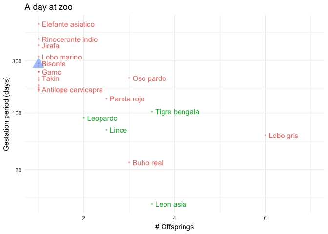

README
================
Pablo Haya
24/02/2019

A Day At The Zoo
================

During a splendid sunny day at the zoo, I was collecting several data facts about animals I saw during the visit. I focused on gestation periods and mean number of offsprings. My first hypothesis was that longer gestation periods lead to fewer number of offsprings. As much time as foetus remains in the placenta, it develops futher, and require more space preventing that other embryos grow up. I performed a very straightforward [analysis using R](/scripts/analysis.R) to test this hypothesis.

After reading literature, I found that this inverse relationship between litter size and gestation period is commonly found in mammals. More interesting, I found that female body mass highly correlates with length of gestation period. Larger animals tend to have longer gestation periods, as they tend to produce larger offspring. In addition, this relationship varies from species to species. I am eager to test it by my own in the future.

The results could inspire a [enquiry-based learning](https://en.wikipedia.org/wiki/Inquiry-based_learning) project for kids that combines outdoor activity, and data analysis.

Main conclusions
----------------

The following chart summarizes the results after analyzing the dataset:

Animal's common name are showed in red, except felines that are highlighted in green. Human is represented by a blue triangle. Gestation periods are in logarithmic scale.

Several insigths can be extracted:

-   Most of the displayed animals has only one offspring. There is a lot of variation (70-660 days) in the gestation period between species with only one offspring.
-   It can be observed a mild inverse relationship between gestation period and number of offsprings that points out to the original hypothesis. Actually, a regression analysis reveals a R-squared of 0.47. It was found that gestation period (log scale) significantly predicts number of offsprings (β = -1.0486, p&lt;.000).
-   All displayed felines share low gestation periods, and a number of offsprings above one.
-   Elephant and Rhinocero gestation periods multiplies human gestation period by two and three respectively. They have the longest gestation periods in land mammals (see references).

Limitations to be taken into account:

-   Dataset observations come from a non-random sampling. Even more, Zoo animals selection is a biased sample as well.
-   Confound variables can be causing a spurious association between gestation periods, and a number of offsprings. Further analysis should be performed.

Dataset
-------

The [dataset](/data/gestationoffsprings.csv) was gathered at [Madrid Zoo Acuarium](https://goo.gl/maps/ZUQfrk8Kr7A2) from animal data sheets on 23th Febraury, 2019. It is a non-random sample of the [Zoo's animals](https://www.zoomadrid.com/en/in-the-zoo/animals). All errors are my own.

Dataset attributes are:

-   `CommonName` most widely used name for this species.
-   `Gestation` number of days between conception and birth. It can be a single figure or a range.
-   `Offspring` number of offsprings produces at a time. It can be a single figure or a range.

**Important notes**

-   Lion's gestation period unit is weeks instead of days, as it appeared on the Zoo's data sheet.
-   Gestation refers specifically to viviparous animals, although there are non-viviparous species in the dataset. In this case, it should be named as incubation instead.

Dataset is provided in the same format as it appears in zoo's datasheets. Nonetheless, a [cleaned version](/data/gestationoffsprings_clean.csv) of the data set is also available.

References
----------

-   [Gestation Periods and Animal Scale](http://www.sjsu.edu/faculty/watkins/gestation.htm) SJSU
-   [Gestation Periods](http://ib.bioninja.com.au/higher-level/topic-11-animal-physiology/114-sexual-reproduction/gestation-periods.html) BioNinja
-   [Chapter 71 - Rhinoceros Theriogenology](https://www.sciencedirect.com/science/article/pii/B9781437719864000718)
-   [Example of enquire-based activity](http://www.olsj.towerhamlets.sch.uk/blogs/year5/wp-content/uploads/sites/8/2017/06/Science-Homework.pdf)
-   J Reprod Fertil. 1963 Aug;6:139-41. NATURE OF THE SYSTEMIC EFFECT OF LITTER SIZE ON GESTATION PERIOD IN MICE.MCLAREN A, MICHIE D.

To Do
-----

-   Complete dataset with weights, scientific names, and classes
-   Translate common names to english
-   Adjust human gestation period to 266 days

License
-------

 The material of this repository is licensed under <a rel="license" href="http://creativecommons.org/licenses/by/4.0/">Creative Commons Attribution 4.0 International License</a>.
